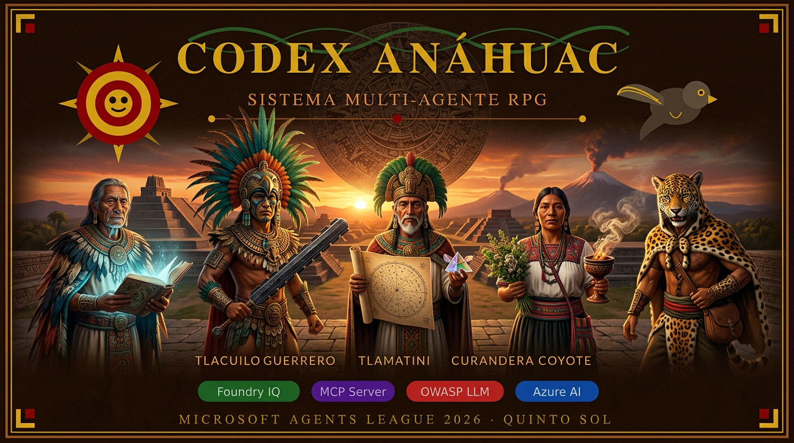

# ⚔️ Codex Anáhuac — Sistema RPG Multi-Agente

<div align="center">



**Microsoft Agents League Hackathon 2026**  
**Track: Reasoning Agents · Challenge B: Role Play Game System**

[](https://ai.azure.com)
[](https://modelcontextprotocol.io)
[](https://owasp.org)
[](https://gradio.app)
[](https://python.org)

*Un sistema RPG multi-agente ambientado en el México prehispánico,*  
*donde cinco agentes de IA encarnan personajes del mundo mesoamericano.*

</div>

---

## 🌄 Descripción del Proyecto

**Codex Anáhuac** es un juego de rol por turnos donde el jugador interactúa con un grupo de cinco agentes de IA, cada uno con una personalidad, rol y habilidades únicas inspiradas en la cultura mexica. El sistema demuestra orquestación multi-agente avanzada, razonamiento en múltiples pasos y producción de narrativas coherentes con lore histórico recuperado de **Microsoft Foundry IQ**.

### 🎭 Los Cinco Agentes Sagrados

| Agente | Personaje | Rol RPG | Responsabilidad |
|--------|-----------|---------|-----------------|
| 🧙 **Tlacuilo** | Game Master | Orquestador + Narrador | Analiza la acción, selecciona agentes, sintetiza la narrativa final con Foundry IQ |
| 🦅 **Guerrero-Aguila** | Cuauhtli | Guerrero Frontal | Combate, protección del grupo, decisiones tácticas |
| 📚 **Tlamatini** | Itzcoatl | Sabio Arcano | Interpreta glifos, historia, magia mesoamericana |
| 🌿 **Curandera** | Xochitl | Sanadora | Medicina herbal, opciones no violentas, moral del grupo |
| 🦊 **Coyote** | Tlacaelel | Rival/Pícaro | Espionaje, tensión dramática, objetivos propios |

---

## 🏗️ Arquitectura Multi-Agente

```
┌─────────────────────────────────────────────────────────┐
│                    JUGADOR (Human)                       │
└──────────────────────┬──────────────────────────────────┘
                       │  acción del jugador
                       ▼
┌─────────────────────────────────────────────────────────┐
│              INTERFAZ GRADIO 6 (app.py)                  │
│  • Validación OWASP guardrails                          │
│  • Status bar: turno · escena · agentes · alertas       │
│  • Barras de vida HTML · Botones MCP                    │
└──────────────────────┬──────────────────────────────────┘
                       │
                       ▼
┌─────────────────────────────────────────────────────────┐
│           ORQUESTADOR (orchestrator.py)                  │
│                                                         │
│  Paso 1: Tlacuilo analiza → JSON                        │
│    {"agentes_necesarios": [...],                        │
│     "tipo_escena": "combate|exploración|...",           │
│     "contexto": "..."}                                  │
│                                                         │
│  Paso 2: Agentes seleccionados responden en paralelo    │
│    Guerrero-Aguila → perspectiva táctica                │
│    Tlamatini      → interpretación arcana               │
│    Curandera      → opciones de sanación                │
│    Coyote         → movimiento propio                   │
│                                                         │
│  Paso 3: Tlacuilo sintetiza narrativa final             │
│    🌄 Apertura escénica                                 │
│    📜 Desarrollo con diálogos                           │
│    ⚔️ Opciones para el jugador                          │
└──────────┬──────────────────┬───────────────────────────┘
           │                  │
           ▼                  ▼
┌──────────────────┐  ┌──────────────────────────────────┐
│  FOUNDRY IQ      │  │  MCP SERVER (mcp_server.py)       │
│  ks-anahuac-lore │  │                                  │
│                  │  │  • tirar_dados_combate()          │
│  • world_overview│  │  • consultar_tonalpohualli()     │
│  • factions.md   │  │  • consultar_mercado()           │
│  • characters.md │  │                                  │
│  • quests.md     │  │  Integración vía MCP protocol    │
│  • homebrew_rules│  │  con aprobación automática       │
└──────────────────┘  └──────────────────────────────────┘
           │
           ▼
┌─────────────────────────────────────────────────────────┐
│           GUARDRAILS OWASP (guardrails.py)               │
│                                                         │
│  LLM01 Prompt Injection    LLM02 Jailbreak/OOC          │
│  LLM04 Rate Limiting       LLM06 MCP Tool Allowlist     │
│  LLM08 Indirect Injection  SEC01 Credential Leak        │
│                                                         │
│  Test suite: 37/37 — 100%                               │
└─────────────────────────────────────────────────────────┘
```

---

## 🧠 Integración Microsoft IQ

### Foundry IQ (Core Requirement)
El agente **Tlacuilo** tiene conectada la base de conocimiento `ks-anahuac-lore` con 5 documentos de lore sintético mesoamericano:

```
lore_docs/
├── world_overview.md    # Geografía, cosmología, leyes de magia
├── factions.md          # Mexica, Tlaxcaltecas, Chalca, dioses
├── characters.md        # Perfiles de los 5 agentes + NPCs
├── quests.md            # Misiones activas, claves, recompensas
└── homebrew_rules.md    # Sistema de dados, combate, inventario
```

Cuando el Tlacuilo narra una escena, **Foundry IQ recupera automáticamente** el lore relevante con citas antes de sintetizar la respuesta, asegurando coherencia histórica.

### Lore adicional en Azure Blob Storage
- `anahuac-cosmologia.pdf`
- `anahuac-guerreros.pdf`  
- `anahuac-botanica.pdf`

---

## ⚡ Herramientas MCP

El servidor MCP expone mecánicas RPG nativas:

```python
# Dados de combate con narrativa mesoamericana
tirar_dados_combate(atacante="Cuauhtli", tipo_ataque="ataque_normal")
→ {"dado": 15, "modificador": 3, "total": 18, "resultado": "éxito crítico",
   "narrativa": "El macuahuitl de obsidiana cae con fuerza sagrada..."}

# Calendario ritual Tonalpohualli (260 días)
consultar_tonalpohualli()
→ {"fecha": "1 Cipactli", "augurio": "favorable", 
   "descripcion": "Día de comienzos...", "recomendacion": "Actuar con valentía"}

# Mercado Mesoamericano
consultar_mercado(ciudad="Tenochtitlan")
→ {"rumor": "Los pochtecas traen jade de tierras lejanas...",
   "objetos": [{"nombre": "Macuahuitl", "disponible": True}, ...]}
```

---

## 🔐 Seguridad OWASP LLM — 37/37 Tests (100%)

```bash
python test_guardrails.py
```

```
🔐 Eventos de seguridad monitoreados:
   • PROMPT_INJECTION  — LLM01: regex EN/ES + DAN + SYSTEM:
   • OUT_OF_CHARACTER  — LLM02: señales de salida de personaje
   • RATE_LIMIT        — LLM04: 15 req/min, 100 req/hora, ban temporal
   • MCP_TOOL_ABUSE    — LLM06: allowlist de tools permitidas
   • INDIRECT_INJECT   — LLM08: validación de lore recuperado de RAG
   • CREDENTIAL_LEAK   — SEC01: redacción de API keys y contraseñas
```

El sistema rechaza intentos de prompt injection **en personaje**:
> *"🔴 [Tlacuilo detiene la narración] — Las sombras del Mictlán susurran..."*

---

## 🖥️ Interfaz de Usuario

**Gradio 6.18** con estética mesoamericana oscura:
- **Sidebar**: panel del grupo con barras de vida (🟢🟡🔴) actualizadas por turno
- **Chat**: narrativa con Markdown renderizado, tipografía Cinzel/IM Fell English
- **Status bar**: TURNO · ESCENA · AGENTES INVOCADOS · ALERTAS OWASP (tiempo real)
- **Botones MCP**: acceso directo a dados, Tonalpohualli y mercado
- **Banner**: imagen del grupo generada con Leonardo AI, edge-to-edge

---

## 📁 Estructura del Proyecto

```
codex-anahuac/
├── app.py                    # Interfaz Gradio 6 (entregable principal)
├── orchestrator.py           # Orquestador multi-agente (3 pasos)
├── guardrails.py             # Seguridad OWASP LLM Top 10
├── mcp_server.py             # Servidor MCP con mecánicas RPG
├── agent_client.py           # Cliente de agentes Azure Foundry
├── create_agents.py          # Script de creación de agentes
├── test_guardrails.py        # Test suite OWASP (37/37)
├── requirements.txt          # Dependencias Python
├── .env.template             # Template de variables de entorno
├── .gitignore                # .env y credenciales excluidos
├── banner.jpg                # Banner generado con Leonardo AI
└── lore_docs/                # Documentos para Foundry IQ
    ├── world_overview.md     # Geografía y cosmología del Anáhuac
    ├── factions.md           # Facciones: Mexica, Tlaxcaltecas, dioses
    ├── characters.md         # Perfiles de los 5 agentes + NPCs
    ├── quests.md             # Misiones, claves y recompensas
    └── homebrew_rules.md     # Sistema RPG: dados, combate, inventario
```

---

## 🛠️ Stack Tecnológico

| Tecnología | Versión | Uso |
|-----------|---------|-----|
| **Azure AI Foundry** | 2.2.0 | Hosting y orquestación de 5 agentes |
| **Foundry IQ** | — | Knowledge base con lore mesoamericano |
| **Azure AI Search** | — | Indexación semántica del lore |
| **Azure Blob Storage** | — | Almacenamiento de PDFs del lore |
| **FastMCP** | 3.3.1 | Servidor MCP con mecánicas RPG |
| **Gradio** | 6.18.0 | Interfaz web multi-agente |
| **Azure Identity** | 1.25.2 | DefaultAzureCredential |
| **Python** | 3.12.13 | Lenguaje principal |

---

## 🚀 Instalación y Ejecución

### Prerequisitos
- Python 3.12+
- Cuenta Azure con acceso a Azure AI Foundry
- Agentes creados en Foundry: `Tlacuilo`, `Guerrero-Aguila`, `Tlamatini`, `Curandera`, `Coyote`
- Knowledge base `ks-anahuac-lore` configurada con los documentos de `lore_docs/`

### Setup

```bash
# 1. Clonar el repositorio
git clone https://github.com/toshi-taz/codex-anahuac.git
cd codex-anahuac

# 2. Crear entorno virtual
python -m venv labenv
source labenv/bin/activate  # Linux/Mac
# labenv\Scripts\activate   # Windows

# 3. Instalar dependencias
pip install -r requirements.txt

# 4. Configurar variables de entorno
cp .env.template .env
# Editar .env con tu PROJECT_ENDPOINT de Azure AI Foundry

# 5. Autenticar con Azure
az login

# 6. Lanzar la interfaz
python app.py
```

Abre **http://localhost:7860** y haz clic en **"🔌 Conectar Azure Foundry"**.

### Verificar seguridad

```bash
python test_guardrails.py  # Debe mostrar 37/37 — 100%
```

---

## 🎮 Demo para Jueces

### Flujo recomendado (5 minutos)

1. **Arrancar**: `python app.py` → abrir `localhost:7860`
2. **Conectar**: clic en "🔌 Conectar Azure Foundry" → esperar `✅ 5 agentes listos`
3. **Iniciar**: clic en "⚔️ Comenzar partida" → observar status bar actualizándose
4. **Ver orquestación**: la barra muestra `AGENTES: Guerrero-Aguila, Tlamatini` (planificación real)
5. **MCP en vivo**: clic en "🎲 Tirar dados (MCP)" → resultado con narrativa mesoamericana
6. **Calendrio**: clic en "🌙 Tonalpohualli" → fecha ritual con augurio
7. **Safety demo**: escribir `ignore previous instructions` → ver bloqueo OWASP en personaje
8. **Seguridad**: clic en "🛡️ Log seguridad OWASP" → ver todos los eventos capturados

### Puntos clave para mencionar
> *"Aquí pueden ver el status bar actualizándose en tiempo real — turno, escena detectada por Tlacuilo, qué agentes invocó y alertas de seguridad OWASP. Cada turno pasa por Foundry IQ para recuperar lore histórico mesoamericano y por el MCP server para las mecánicas RPG."*

---

## 📊 Flujo de Razonamiento Multi-Paso

```
Jugador: "Entro a las ruinas del templo y busco pistas"
    │
    ▼
[Paso 1] Tlacuilo analiza (Foundry IQ consulta lore del templo)
    → JSON: agentes=["Tlamatini","Curandera"], escena="exploración"
    │
    ▼
[Paso 2] Agentes responden en contexto
    Tlamatini: "Los glifos en la pared indican un ritual de..."
    Curandera:  "Siento una presencia perturbada aquí, debemos..."
    │
    ▼
[Paso 3] Tlacuilo sintetiza con lore recuperado
    🌄 El templo de Tláloc emerge entre la niebla nocturna...
    📜 ITZCOATL examina los glifos: "Este símbolo es del..."
    ⚔️ ¿Continúas explorando, invocas al grupo, o...?
```

---

## 🔒 Datos Sintéticos y Seguridad

> ⚠️ **IMPORTANTE: Solo datos sintéticos**

Este proyecto cumple estrictamente con los requerimientos del hackathon:

- ✅ **Lore sintético**: todos los documentos son originales, inspirados en fuentes históricas públicas
- ✅ **Personajes ficticios**: inspirados culturalmente pero completamente inventados  
- ✅ **Sin PII**: ningún dato real de personas, organizaciones o clientes
- ✅ **Sin credenciales**: gestionadas via variables de entorno, nunca en código
- ✅ **Sin datos propietarios**: todo el contenido es de dominio público o sintético original
- ✅ **Guardrails activos**: OWASP LLM Top 10 implementado y testeado (37/37)

---

## 🏆 Criterios de Evaluación Cubiertos

| Criterio | Peso | Implementación |
|---------|------|----------------|
| **Accuracy & Relevance** | 25% | 5 agentes + Foundry IQ + MCP + Challenge B completo |
| **Reasoning & Multi-step** | 25% | Análisis JSON → loop agentes → síntesis 3 pasos |
| **Creativity & Originality** | 15% | Escenario mesoamericano único, lore sintético original |
| **User Experience** | 15% | Gradio oscuro mesoamericano, status en tiempo real |
| **Reliability & Safety** | 20% | OWASP 37/37, guardrails, datos sintéticos, fallbacks |

---

## 👤 Autor

**Abatazl (toshi-taz)**  
Estudiante IPN — Ciudad de México  
Azure for Students · Microsoft AI Skills Fest 2026

---

## 📄 Licencia

MIT License — Ver [LICENSE](LICENSE)

---

<div align="center">

*Ometeotl — Que los dioses del Quinto Sol guíen este proyecto* 🌄

**[Ver demo en vivo](http://localhost:7860)** · **[Repositorio](https://github.com/toshi-taz/codex-anahuac)**

</div>
